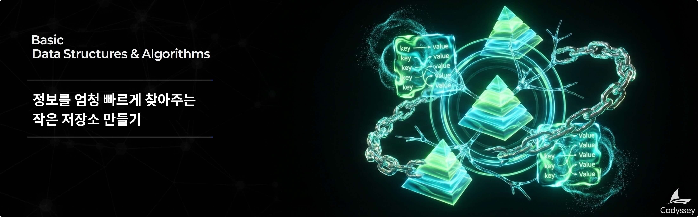

# B3-1: 정보를 엄청 빠르게 찾아주는 작은 저장소 만들기

## 📋 과제 정보

| 항목 | 내용 |
|------|------|
| **과목** | 자료구조와 알고리즘 (Data Structures & Algorithms) |
| **난이도** | ★★☆ (Lv.2) |
| **학습 시간** | 80분 |
| **필수 여부** | ✅ 필수 |
| **진행 상태** | PASS |
| **과제 번호** | 185008 |

---

## 🎯 미션 설명



---

## 🛠️ 개발 환경

### 6\. 개발 환경

*   Python 3.8 이상

---

## ⚠️ 제약 사항

### 7\. 제약 사항

*   라이브러리/내장 자료형 제한(학습 목적)
    *   `dict`, `set`, `collections` 사용 금지
    *   단, “고정 길이 배열/인덱스 접근” 수준의 저장소가 필요하다면 제한적으로 사용할 수 있는 구현 방식을 선택하되, 내장 컬렉션으로 해시맵/캐시를 대체하는 방식은 금지한다 (예: dict로 put/get 구현 금지).
*   구조
    *   각 자료구조(해시맵/이중 연결 리스트/힙)는 독립된 모듈/파일로 분리한다
    *   핵심 클래스/함수에는 주석 또는 docstring을 작성한다
*   기능 범위
    *   네트워크 통신은 구현하지 않는다(오직 CLI)
    *   데이터 영속성(파일 저장)은 구현하지 않는다
    *   Redis의 복잡 자료형(List/Set/Sorted Set)은 구현하지 않는다
    *   멀티스레딩/락 같은 동시성 처리는 요구하지 않는다

---

## 📝 결과 예시

### 8\. 결과 예시

아래는 정답이 아니라 참고 예시다. 실제 실행 예시는 달라도 되지만, 평가를 위해 최대한 이해하기 쉬운 형태로 개발한다.

*   실행 예시
    
    ```css
    mini-redis> CONFIG SET maxmemory 30
    OK
    mini-redis> SET user:1 "Alice"
    OK
    mini-redis> SET user:2 "Bob"
    OK
    mini-redis> SET user:3 "Charlie"
    OK
    
    # maxmemory(30) 초과로 LRU(user:1) 제거
    
    mini-redis> GET user:1
    (nil)
    mini-redis> INFO memory
    used_memory:22
    maxmemory:30
    evicted_keys:1
    mini-redis> KEYS
    1. "user:2"
    2. "user:3"
    mini-redis> EXPIRE user:2 3
    (integer) 1
    mini-redis> TTL user:2
    (integer) 2
    
    # (3초 경과 후)
    
    mini-redis> GET user:2
    (nil)
    mini-redis> TTL user:2
    (integer) -2
    ```
    
*   에러 출력 예시(예)
    
    ```css
    mini-redis> CONFIG SET maxmemory abc
    (error) ERR value is not an integer or out of range
    mini-redis> GET
    (error) ERR wrong number of arguments for 'GET' command
    mini-redis> HELLO
    (error) ERR unknown command 'HELLO'
    ```

---

## 📊 평가 정보

- 평가 대상: 예

---

> *이 문서는 Codyssey AI/SW 기초 과정의 과제 내용을 기반으로 자동 생성되었습니다.*
